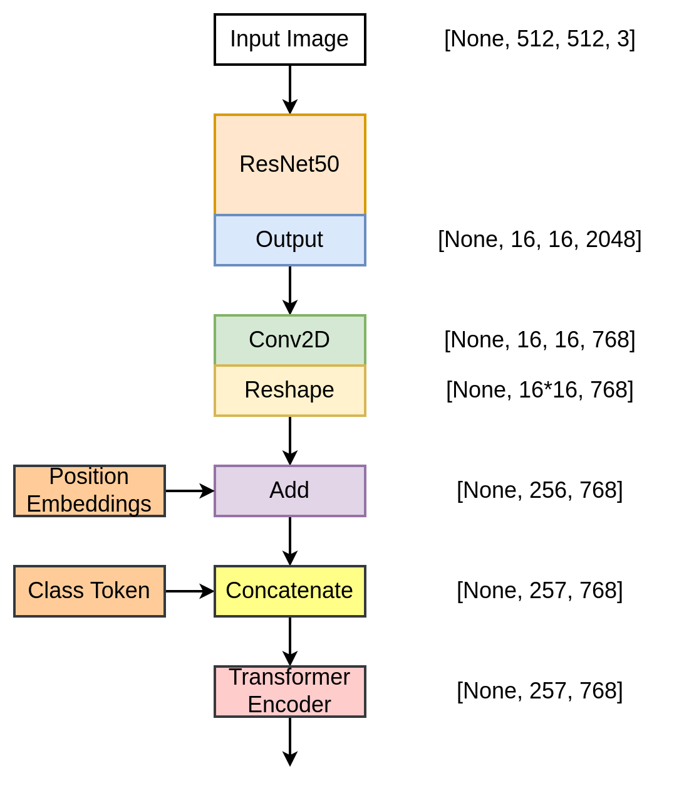
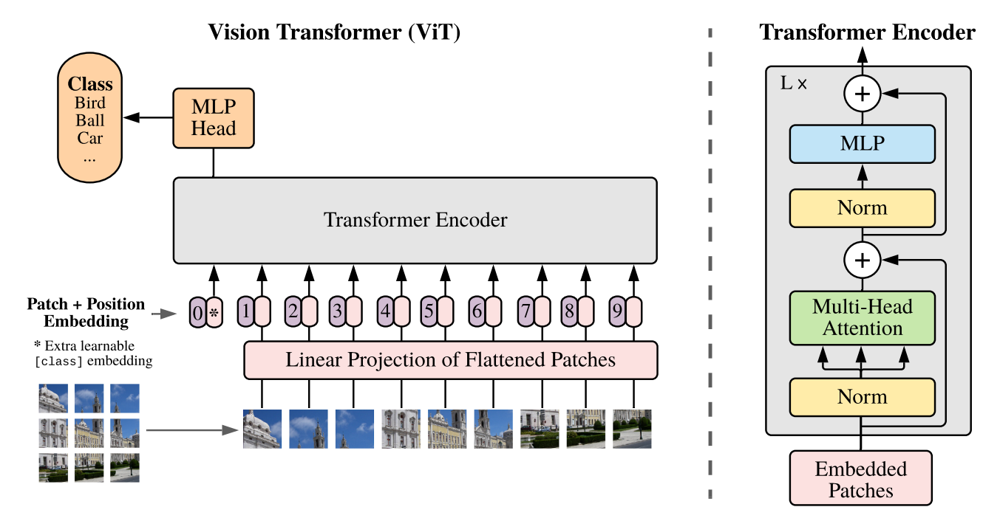

# ResNet50 + Vision Transformer (ResNet50-ViT)

A hybrid image classifier that pairs an **ImageNet-pretrained ResNet50** backbone with a **Vision Transformer (ViT) encoder head** for fine-grained image classification. The convolutional stack acts as a powerful, low-resolution feature extractor, and a stack of transformer encoder blocks reasons globally over the resulting feature grid before producing class logits.

> Author: **Brian Rono** · [engbriankrono@gmail.com](mailto:engbriankrono@gmail.com)
> Repo: [`BrianRono7/-ResNet50-ViT--Vision-Transformer-ResNet50`](https://github.com/BrianRono7/-ResNet50-ViT--Vision-Transformer-ResNet50)

---

## Why this hybrid?

A vanilla ViT splits the input image into fixed-size patches and feeds them directly to a transformer. This works well when you have enough data, but for many real-world tasks a CNN front-end is still a strong inductive bias. This project keeps ResNet50's convolutional feature extractor and replaces the global-average-pooling head with a ViT-style transformer, so the model gets:

* **Local translation invariance** from the convolutional backbone.
* **Global receptive field** and pairwise token attention from the transformer.
* **Transfer learning** from ImageNet pretraining of the ResNet50 stem.



The pure Vision Transformer it builds on top of:



---

## Architecture

```
Input image  (B, 512, 512, 3)
   │
   ▼
ResNet50 (pretrained, include_top=False)            →  (B, 16, 16, 2048)
   │
   ▼
Patch-embedding Conv2D (32×32, padding="same")     →  (B, 16, 16, 768)
   │
   ▼
Reshape                                             →  (B, 256, 768)
   │              ┌── learned positional embedding (256, 768)
   ▼              │
add pos-embed  ◀──┘
   │
   ▼
Prepend learned [CLS] token                         →  (B, 257, 768)
   │
   ▼
Transformer encoder × 12
   ├── LayerNorm → Multi-Head Self-Attention (12 heads) → residual add
   └── LayerNorm → MLP (gelu, hidden 3072 → 768)        → residual add
   │
   ▼
LayerNorm → take [CLS] row                          →  (B, 768)
   │
   ▼
Dense(num_classes, softmax)                         →  (B, 10)
```

### Verified parameter count (after the import fix)

Running `model.summary()` on the default config produces:

| Metric              | Value                  |
|---------------------|------------------------|
| Total params        | **2,030,996,106** (~2.03 B) |
| Trainable params    | **2,030,942,986**      |
| Non-trainable params| **53,120** (ResNet50 BN running stats) |
| Input               | `(None, 512, 512, 3)`  |
| Output              | `(None, 10)` — softmax |

Most of the parameter count is the ImageNet-pretrained ResNet50 convolutional trunk (~25.6 M params) plus the 12 transformer encoder blocks (~85 M params each). The classification head contributes only ~7.7 K parameters.

---

## Repository layout

```
ResNet50/
├── README.md                ← this file
├──  ResNet50-ViT.py         ← model definition + summary print
└── img/
    ├── ResNet50-ViT.png     ← hybrid architecture diagram
    └── vit.png              ← reference Vision Transformer diagram
```

> Note: the file is intentionally named ` ResNet50-ViT.py` (with a leading space). Keep it that way if you have downstream notebooks or links pointing at it.

---

## Requirements

* Python 3.9+
* TensorFlow 2.12+ (tested with the Keras 3 backend path)
* NumPy

A minimal setup:

```bash
python -m venv .venv
source .venv/bin/activate          # Windows: .venv\Scripts\activate
pip install --upgrade pip
pip install tensorflow numpy
```

On first run, Keras will download `resnet50_weights_tf_dim_ordering_tf_kernels_notop.h5` (~95 MB) into `~/.keras/models/`.

---

## Quick start

The script prints the model summary when run as a module:

```bash
python " ResNet50-ViT.py"
```

Expected output (truncated):

```
Model: "model"
_________________________________________________________________
 Layer (type)                Output Shape              Param #
=================================================================
 input_1 (InputLayer)        [(None, 512, 512, 3)]     0
 conv1_pad (ZeroPadding2D)   (None, 518, 518, 3)       0
 conv1_conv (Conv2D)         (None, 256, 256, 64)      9,472
 ...
 dense_24 (Dense)            (None, 10)                7,690
=================================================================
 Total params: 2,030,996,106 (7.57 GB)
 Trainable params: 2,030,942,986 (7.57 GB)
 Non-trainable params: 53,120 (207.50 KB)
```

A minimal forward pass in your own code:

```python
import numpy as np
import importlib.util, sys

spec = importlib.util.spec_from_file_location(
    "ResNet50ViT", " ResNet50-ViT.py"
)
mod = importlib.util.module_from_spec(spec); spec.loader.exec_module(mod)

config = {
    "num_layers": 12, "hidden_dim": 768, "mlp_dim": 3072, "num_heads": 12,
    "dropout_rate": 0.1, "image_size": 512, "patch_size": 32,
    "num_patches": (512 // 32) ** 2, "num_channels": 3, "num_classes": 10,
}
model = mod.ResNet50ViT(config)

x = np.zeros((1, 512, 512, 3), dtype="float32")
probs = model(x, training=False)               # (1, 10), sums to 1
```

---

## Configuration

The whole model is driven by a single `config` dict — easy to tweak for ablations:

| Key             | Default | Meaning                                                   |
|-----------------|---------|-----------------------------------------------------------|
| `image_size`    | `512`   | Square input side. Backbone expects divisible by 32.      |
| `patch_size`    | `32`    | The patch-embedding Conv2D kernel/stride.                 |
| `num_patches`   | `256`   | `(image_size / patch_size) ** 2`. Computed automatically. |
| `num_channels`  | `3`     | Input channels (RGB).                                     |
| `num_classes`   | `10`    | Final softmax dimension.                                  |
| `hidden_dim`    | `768`   | Transformer token width.                                  |
| `mlp_dim`       | `3072`  | Transformer feed-forward hidden size.                     |
| `num_heads`     | `12`    | Self-attention heads. `hidden_dim % num_heads == 0`.      |
| `num_layers`    | `12`    | Number of stacked transformer encoder blocks.             |
| `dropout_rate`  | `0.1`   | Dropout in MLP blocks.                                    |

### Common variations

* **Smaller model for prototyping** — drop `image_size` to 224, `num_layers` to 6, `hidden_dim` to 384. Remember to recompute `num_patches = (224 // 32) ** 2 = 49` and to retrain/freeze appropriately.
* **Different backbone** — swap `tf.keras.applications.ResNet50` for `EfficientNetB0`, `ConvNeXtTiny`, etc., as long as the spatial output divides your patch grid cleanly.
* **Freeze the backbone** — set `resnet50.trainable = False` after construction to train only the transformer head (fast, useful for transfer learning with limited data).

---

## Training template

The shipped script only defines the model. To train it on a folder-based image dataset, plug it into a standard Keras pipeline:

```python
import tensorflow as tf
from tensorflow.keras.callbacks import ModelCheckpoint, EarlyStopping

# 1) build the model (as in Quick start)
model = mod.ResNet50ViT(config)

# 2) optional: freeze the ResNet50 trunk for warm-up
backbone = model.get_layer("resnet50")
backbone.trainable = False
model.compile(
    optimizer=tf.keras.optimizers.Adam(1e-3),
    loss="sparse_categorical_crossentropy",
    metrics=["accuracy"],
)

# 3) data pipeline — replace with your own train/val directories
train_ds = tf.keras.utils.image_dataset_from_directory(
    "data/train", image_size=(512, 512), batch_size=8, label_mode="int",
).map(lambda x, y: (tf.cast(x, tf.float32), y))

val_ds = tf.keras.utils.image_dataset_from_directory(
    "data/val", image_size=(512, 512), batch_size=8, label_mode="int",
).map(lambda x, y: (tf.cast(x, tf.float32), y))

AUTOTUNE = tf.data.AUTOTUNE
train_ds = train_ds.cache().prefetch(AUTOTUNE)
val_ds   = val_ds.cache().prefetch(AUTOTUNE)

callbacks = [
    ModelCheckpoint("resnet50_vit_best.keras", monitor="val_accuracy",
                    save_best_only=True),
    EarlyStopping(monitor="val_accuracy", patience=5, restore_best_weights=True),
]

model.fit(train_ds, validation_data=val_ds, epochs=30, callbacks=callbacks)

# 4) optionally unfreeze and fine-tune with a low LR
backbone.trainable = True
model.compile(
    optimizer=tf.keras.optimizers.Adam(1e-5),
    loss="sparse_categorical_crossentropy",
    metrics=["accuracy"],
)
model.fit(train_ds, validation_data=val_ds, epochs=10, callbacks=callbacks)
```

---

## Notes & gotchas

* **Memory.** A 2-billion-parameter graph at fp32 is ~7.6 GB just for weights. Backprop activations and the Adam optimizer state roughly **double** GPU memory demand. On a single 8 GB GPU you will likely need to drop `batch_size` to 1–2, enable mixed precision (`tf.keras.mixed_precision.set_global_policy("mixed_float16")`), and/or freeze the backbone.
* **Image size must be divisible by 32.** ResNet50 downsamples by 32; the patch-embedding conv has stride 32.
* **Import hygiene.** The current script imports `tf.keras.applications.ResNet50` but references several other Keras symbols (`Layer`, `Dense`, `LayerNormalization`, `MultiHeadAttention`, `Conv2D`, `Embedding`, `Concatenate`, `Input`, `Reshape`, `Dropout`, `Add`) by bare name. They must be explicitly imported, or you will hit `NameError: name 'Layer' is not defined` on import. The fix used here is to add a single `from tensorflow.keras.layers import (...)` line.
* **The ` ClassToken` class uses `tf.Variable` directly.** That works, but for distribution strategies (multi-GPU, TPU pods) prefer `self.add_weight(..., initializer=...)` so the variable is registered with the layer properly.
* **Preprocessing.** The default config does not apply ResNet50's preprocessing function (`tf.keras.applications.resnet50.preprocess_input`). If you fine-tune end-to-end with ImageNet-pretrained weights, normalize inputs with that function; otherwise the backbone's activations will be off-distribution.
* **Class token vs GAP.** Classification here uses the `[CLS]` token (ViT style). If you find training unstable on small datasets, switching to global-average-pooling over the patch tokens often helps.

---

## Roadmap

* [ ] Extract training/evaluation into a `train.py` CLI with YAML config.
* [ ] Add Grad-CAM and attention-map visualization utilities.
* [ ] Mixed-precision and XLA-friendly variant for TPU.
* [ ] Optional Swin-style shifted-window attention to scale to larger inputs.
* [ ] Publish weights for a reference fine-tune.

---

## License

No license file is currently included in this repository. Until one is added, treat the code as **all rights reserved by the author**. If you'd like to reuse or redistribute it, please open an issue or contact Brian Rono.

---

## Acknowledgements

* **Kaiming He et al.** — *Deep Residual Learning for Image Recognition* (ResNet, CVPR 2016).
* **Alexey Dosovitskiy et al.** — *An Image is Worth 16×16 Words: Transformers for Image Recognition at Scale* (ViT, ICLR 2021).
* The Keras team for `tf.keras.applications` and the `MultiHeadAttention` layer.

---

<div align="center">

Made with curiosity and a lot of `model.summary()` calls · ⭐ the repo if it helped!

</div>